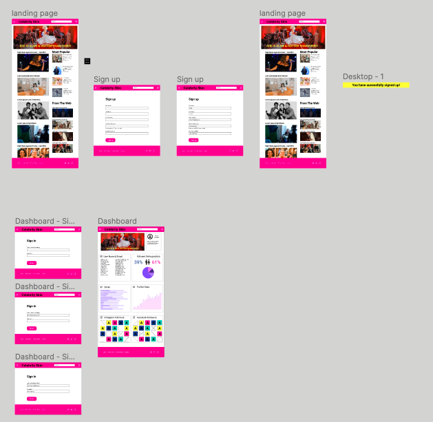
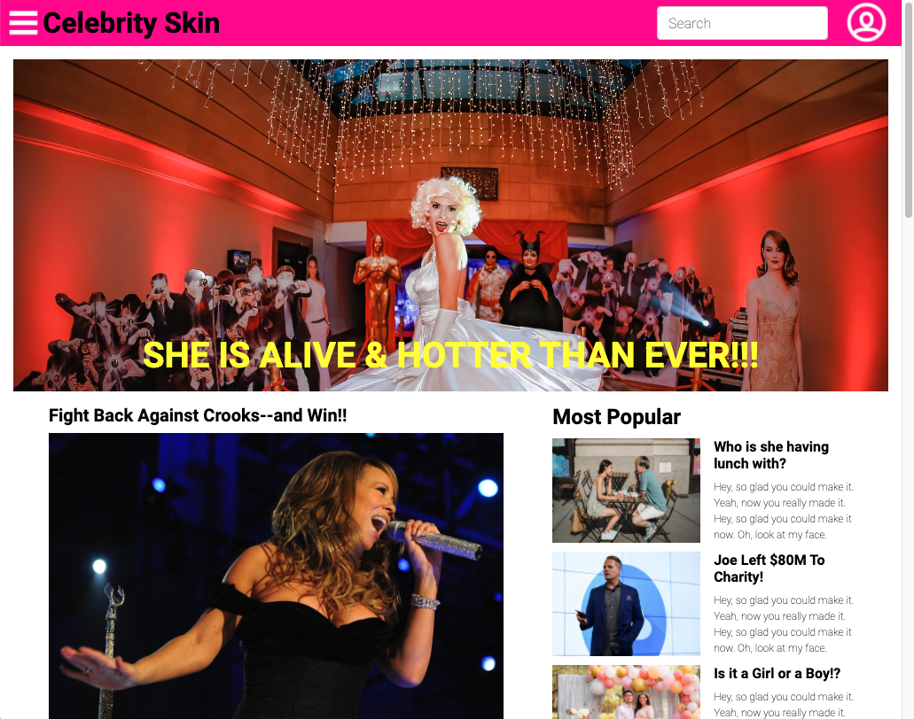
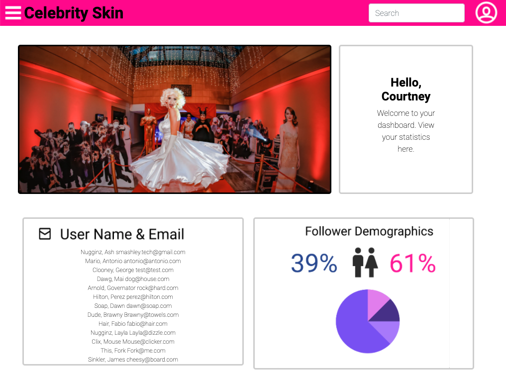
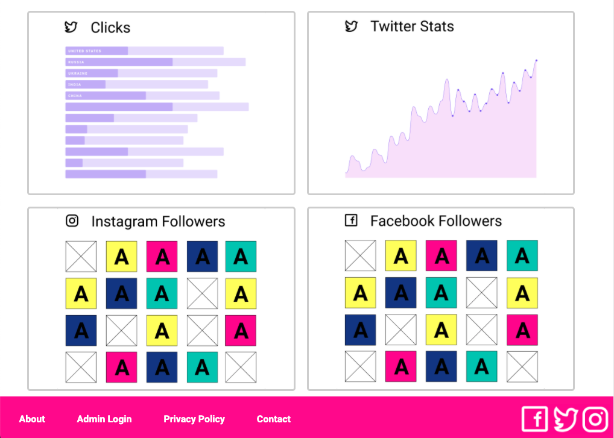

# Celebrity Skin - Collabathon

General Assembly hosted a 24-hour collabation challenge. Software engineering students collaborated with UX/UI design students. Teams were randomly assigned members, provided with a brief, and assigned a hypothetical client. 

**Our Assignment:** Celebrity Gossip

# Motivation
The purpose of this event was to give students the oportunity to gain experirential knowledged of what it is like to work with interdisciplinary teams.

As a team, we learned it's not just how often you communicate, but WHAT you communicate that matters. We noticed the order of development differs across disciplines. From a design perspective, Designers start from the big picture and working toward the smaller device. Software Engineers however, take a mobile-first approach. We experienced the repurcussions of failing to communicate that from the outset. 

All of use walked away with the understanding of that some details should be prioritized for discussion in the initial team meeting. 

# Technologies Used
* HTML
* CSS
* Javascript
* Express
* EJS
* EJS-Layouts
* Express Sessions
* Express Passport
* Flash
* Sequelize
* PostgresSQL

## Project Brief (Design Team)
For this UI Design and Development project, your team’s assignment is to create an ​accessible landing page for users​ and a ​dashboard for your client​.

## Requirements (Design Team)

* A single landing page for users.
* A dashboard for your client.
* Must be accessible:
* Think about contrast, color, alt-text, etc.
* Use the ​a11y checklist
* Responsive, browser-based site.
* Must work in Chrome.
* Do not need to worry about the OS.
* As a business, we need this landing page to represent our brand and entice the target users to join our group
* As a business, we want to be able to see the data being collected from the sign-up in a dashboard.

## Software Engineering Goal
* Users must be able to sign in
* Create a databased to store user information
* Create a pseudo admin page that displays list of all users (first names and email)

# User Stories
* As a user, I want to learn more about the client and their offerings.
* As a user, I want a way to sign-up to join the group.
* As a user, I want confirmation that I successfully signed-up for the group.

# Figma Wireframes & Link
* https://www.figma.com/file/aDKlrg0iSetg4eT4IvXkEO/Celebrity-Skin?node-id=144%3A287

# Screenshots

